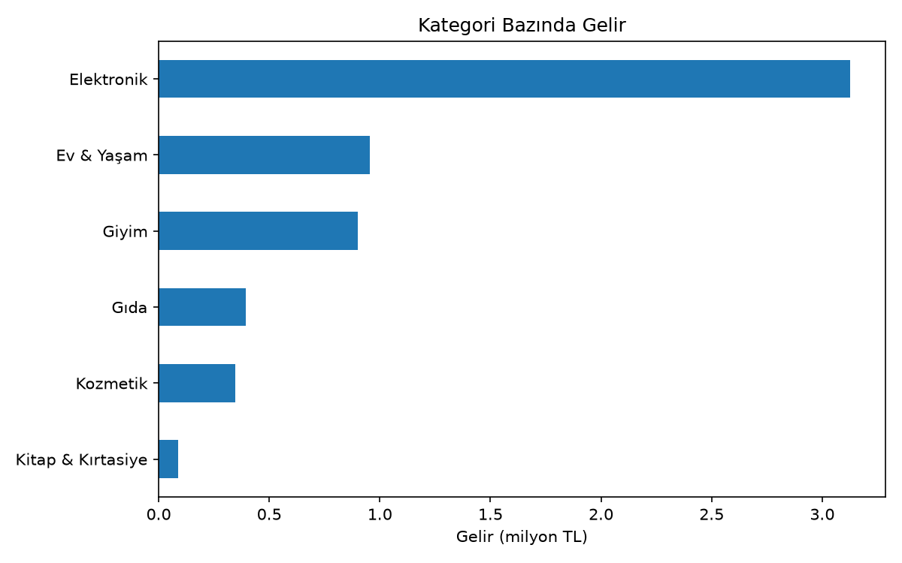
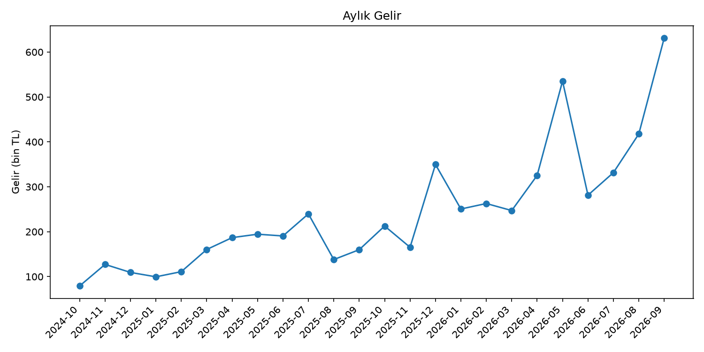
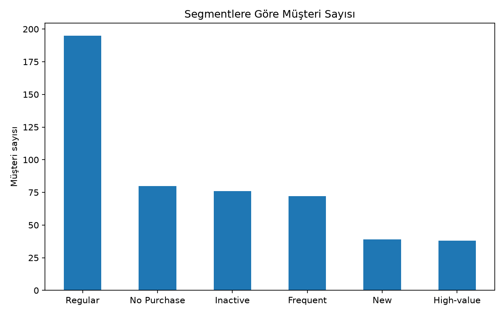

# Retail Customer Analytics

Python and Pandas project that analyzes customer and order data of a retail company to find purchasing patterns, customer segments, and category-level sales trends.

## Data

The dataset is **synthetic** and generated with Python (`src/generate_data.py`, fixed random seed):

- `customers.csv`: 500 customers (customer_id, age, city, signup_date)
- `orders.csv`: 3,000 orders over the last 2 years (order_id, customer_id, order_date, category, quantity, unit_price)

Orders cannot predate the customer's signup date, and a small group of customers places most orders to mimic real retail behavior.

**Limitations:** Because the data is synthetic, the monthly growth trend and the high repeat-purchase rate (86.7%) do not represent a real company.

## Project structure

- `src/generate_data.py`: generates the CSV files
- `src/data_processing.py`: reads and inspects the CSV files
- `src/analysis.py`: Pandas analysis, segmentation, and charts
- `images/`: generated charts

## How to run

```
pip install -r requirements.txt
python src/generate_data.py
python src/analysis.py
```

## Key findings

- Electronics generates about 54% of revenue while making up only about 7% of orders.
- The top 10 customers generate about 14% of total revenue.
- Average order value is 1,936 TL, but the median unit price is much lower (about 382 TL), so the average is pulled up by electronics.
- Revenue per customer is similar across cities (about 10.7k-11.9k TL), so Istanbul's higher revenue comes from having more customers, not higher spending.
- 86 of 500 customers never placed an order.

## Customer segmentation

Rules are applied in this order (first matching rule wins):

| Segment | Rule |
|---|---|
| New | Signed up in the last 90 days |
| No Purchase | Never placed an order |
| Inactive | Last order more than 180 days ago |
| High-value | Total spending in the top 10% |
| Frequent | Order count in the top 25% |
| Regular | Everyone else |

High-value customers (38, about 7.6% of customers) generate about 36% of revenue.

## Charts





## Next steps

- Repeat the same analysis with SQL (PostgreSQL)